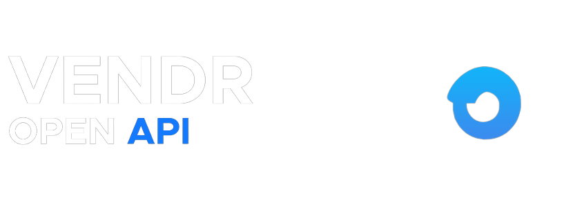

# About
Vendr SDK on ROBLOX

The Vendr OpenAPI Wrapper makes it easy for developers to interact with our ROBLOX Hub

- Simple and easy to use
- 100% of the Vendr API

With that its now been brought to Luau.

# Install

*with Roblox Marketplace*

`None`


# Usage

First you will need to create a Parcel object


```lua
local Vendr = require(path/to/vendr)
```

Then, you may now use these features!

**GetUserInformation**

`self.GetUserInformation({method : string, id : number})`

```lua
local Vendr = require(path/to/vendr)

Vendr.GetUserInformation('roblox',"000000")

```

**GetLinkCode**

`self.GetLinkCode({robloxID: number})`

```lua
local Vendr = require(path/to/vendr)

Vendr.GetLinkCode(robloxID: number)
```
